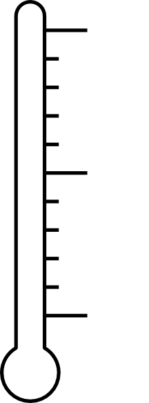
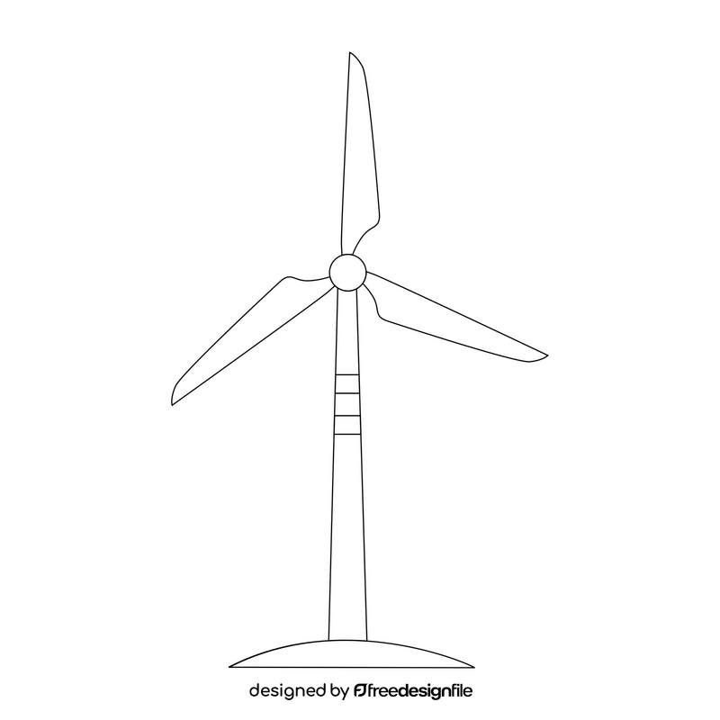

# Energy distribution through battery

### Definition

Our project will simulate how energy is produced through a Windturbine, connected to one Home and a battery. When the Home is fully powered the extra energy left produced from the Windturbine, will be stored in an external Battery. 
When there is no wind, no new energy will be produced from the Windturbine, and the Home will receive the stored energy from the external Battery.

## Part 1 - The Windturbine
Part 1 focuses on gathering wind speed data from the website https://opendataapi.dmi.dk/v2/metObs. The data is the average wind speed every day for the interval 2025-01-01 to 2025-12-31 (so a full year). These wind_speed numbers are used as follows: 

def wind_speed_for_day(day):
    value = loop_df.loc[day, "Middelvind"]
    if pd.isna(value):
        return None
    return float(value)

def Wind_Power(v):
    if v is None:
        return None
    return 19232.5 * (v ** 3)

def Windturbine_Produced(v):
    wind_power = Wind_Power(v)
    if wind_power is None:
        return None
    return C * wind_power

Where C = 0.4

Windturbine_Produced is the amount of energy the Windturbine Produces. With the numbers from https://opendataapi.dmi.dk/v2/metObs, Windturbine_Produced would be 24054796.55888847 kWh in a year, meaning Windturbine_Produced_Yearly = 24054796.55888847 kWh

## Part 2 - The Home
The Home draw energy from the Windturbine. The average energy usage pr month is as follows:

1 person in apartment = 121 kWh
1 person in house = 183 kWh
2 persons in apartment = 188 kWh
2 persons in house = 258 kWh
3 persons in apartment = 246 kWh
3 persons in house = 325 kWh
4 persons in apartment = 292 kWh
4 persons in house = 383 kWh
5 persons in apartment = 342 kWh
5 persons in house = 442 kWh
6 persons in apartment = 383 kWh
6 persons in house = 500 kWh

From my own calculations, the Windturbine produces 24054796.56 kWh in a year, defined as Windturbine_Produced_Yearly.

The normal amount of persons in a Home is 4. Generate 10 Homes (both houses and apartments) with a normal distribution around that. 

The homes monthly average energy usage is the average usage over a year. This means that every month can be +/- 7% of this. In the winter months, the homes mostly use up to + 7% more and in the summer they use up to 7% less. 

This gives us 5900 randomly generated homes that can be powered by the Windturbine. 

Part 3 will focus on the distribution of the energy between the Windturbine, the Homes and the Battery.
The following describes variables and constants that you can collect from the broker. it is ESSENTIAL that they are keeping their definitions as written bellow:
Windturbine_Produced = amount of energy the Windturbine produces. This is a variable collected from the broker.
Home_Usage = amount of energy the Homes uses. This is a variable collected from the broker.
Battery_Storage = how much energy is stored in the Battery. This is a variable dependant on Windturbine_Produced and Home_Usage. 

Windturbine_Produced and Home_Usage are treated as already daily energy values (kWh/day).

The simulation takes part over a year. Every day (The data is given in days for both the Windturbine_Produced and for the Home_Usage) is one second. The unit is in kW and kWh. The Battery capacity is 100.000 kW. the initial storage of the battery is 50%. When battery is 0%, the homes cant draw energy from them, but nothing visual happens. When the battery is 100%, the excess energy dissapears from the system.
Replace the word "power" with "energy".
The windmill blades must spin, the battery must be colored according to persentage and the indicators around the bar must update according to Home_Usage and Windturbine_Produced

## Part 4 - The Visualization
The total simulation will visualize the flow of energy from the Windturbine to the Home, with the battery as a storage for energy, that the Home can use when the Windturbine is not producing enough energy (when Home_Usage > Windturbine_Produced)
The way that it will be visualized is a windturbine with an arrow pointing to a bar (Home_Energy_Usage). One indicator on the right side of the bar, shows how much energy the Home uses (Home_Usage) and an indicator on the left side showing how much energy is produced by the windturbine (Windturbine_Produced). Above them is a battery (Battery_Persentage). An arrow points from the Windturbine to the Battery and from the Battery to the Home. The persentage that the battery is full is indicated by how much of the battery (Battery_Percentage) is filled green (from left to right)

### My Smart City Project: Battery

#### 1. The Trigger (Who/What is moving?)
The battery will collect data from the broker. When the Windturbine creates more energy (Windturbine_Produced) than the Homes use (Home_Usage), the excess energy fills the battery (Battery_Max). 
When the Home is in an energy deficit (Windturbine_Produced < Home_Usage), the Home uses the energy stored in the Battery (Battery_Storage), hence draining the battery. 

If Windturbine_Produced = Home_Usage then no changes in Battery (Battery_Storage).
If Windturbine_Produced > Home_Usage then excess energy fill Battery until Battery_Max
If Windturbine_Produced < Home_Usage then Homes draw energy from Battery_Storage

#### 2. The Observer (What does the city see?)
The sensor notices when the home is in an energy surplus, and sends the excess energy to the battery. The sensor also notices when the home is in an energy deficit and sends energy from the battery to the home. 

#### 3. The Control Center (The Logic)
When the Home is in an energy surplus, energy will go to the Battery from the Windturbine. When the Home is in an energy deficit, energy will be sent from the battery to the Home. 

#### 4. The Response (What happens next?)
When the Home is in an energy surplus, energy will go to the Battery from the Windturbine. When the Home is in an energy deficit, energy will be sent from the battery to the Home.
If the Battery is full, the excess energy will dissapear out of the system.

#### 5. How to calculate Output of Windturbine

Wind_Power is calculated from = 0.5 × ρ × v^3 × A, where ρ = 1.225 kg/(m^3), A = 31.400 m^2 and v is the variable defined as def wind_speed_for_day(day):
    value = loop_df.loc[day, "Middelvind"]
    if pd.isna(value):
        return None
    return float(value)

This can also be written as Wind_Power ​= 19,232.5 kg/m ​⋅ v^3, seeing as v is the only variable
Windturbine_Produced is calculated from = C × Wind_Power, where C = 40%.
Example where v= 5m/s:
Wind_Power = 0.5 * 1.225 kg/m³ * (5.5m/s)^3 * 31.400 m^2 =  19×10^6W
Windturbine_Produced = 0,4 * 3.19×10^6W = 1,276,000W = 1,276 kW

The output should ALWAYS be written in kW.

---
